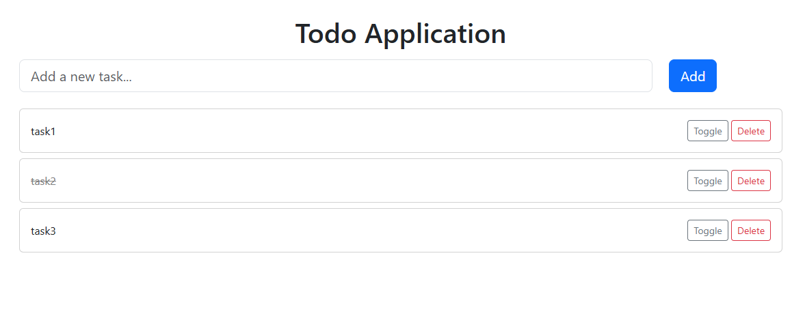

# 📝 ToDo List Application

A simple yet complete CRUD-based **ToDo List** web application built with **Spring Boot**, **Thymeleaf**, **Hibernate (JPA)**, **MySQL**, **Lombok**, and **Bootstrap 5**.  
This project demonstrates modern full-stack development practices in the Java ecosystem using clean MVC architecture, and can be used as a showcase in your resume or portfolio.

---

## 📌 Features

- Add new tasks
- View all tasks
- Toggle task completion status
- Delete tasks
- Responsive UI with Bootstrap
- MVC pattern using Spring Boot
- MySQL + Hibernate (JPA) for persistence
- Thymeleaf for server-side rendering
- Lombok for reducing boilerplate code

---

## 🧱 Tech Stack

| Layer        | Technology                      |
|--------------|----------------------------------|
| Backend      | Spring Boot 3.x, Spring MVC      |
| ORM          | Spring Data JPA (Hibernate)      |
| Database     | MySQL                            |
| Frontend     | Thymeleaf + Bootstrap 5          |
| Dependency   | Maven                            |
| Boilerplate  | Lombok                           |
| IDE          | IntelliJ IDEA                    |

---

## 🗂️ Project Structure

```

src/
├── main/
│   ├── java/
│   │   └── com.app.ToDoList/
│   │       ├── controller/
│   │       │   └── TaskController.java
│   │       ├── model/
│   │       │   └── Task.java
│   │       ├── repository/
│   │       │   └── TaskRepository.java
│   │       └── service/
│   │           └── TaskService.java
│   └── resources/
│       ├── templates/
│       │   └── tasks.html
│       └── application.properties

````

---

## 📄 API Endpoints

| Method | Endpoint            | Description               |
|--------|---------------------|---------------------------|
| GET    | `/`                 | View all tasks            |
| POST   | `/`                 | Create a new task         |
| GET    | `/{id}/delete`      | Delete a task by ID       |
| GET    | `/{id}/toggle`      | Toggle task completion    |

---

## 🔧 Configuration

### `application.properties`

```properties
spring.application.name=ToDoList

spring.datasource.url=jdbc:mysql://localhost:3306/<database-name>
spring.datasource.username=<user-name>
spring.datasource.password=<password>

spring.jpa.hibernate.ddl-auto=update
````
---

## ✅ How to Run

### 1. Clone the repository

```bash
git clone https://github.com/fatemesoleymanian/ToDoListApp_With_Java.git
cd ToDoListApp_With_Java
```

### 2. Setup the database

Create a MySQL database:

```sql
CREATE DATABASE springboot(or desires name);
```

### 3. Run the application

You can run the application via your IDE (IntelliJ) or via terminal:

```bash
./mvnw spring-boot:run
```

> Access the app at: `http://localhost:8080/`

---

## 📸 UI Preview


*(Add a real screenshot here when you deploy or run the app locally)*

---

## 🧠 Learning Outcomes

* Spring Boot MVC architecture
* Integrating JPA (Hibernate) with MySQL
* Thymeleaf template engine
* Bootstrap for clean, responsive UIs
* Using Lombok for clean and concise model code
* Writing controller-driven views with Spring MVC

---

## ✍️ Author

**Fateme Soleymanian**
[LinkedIn](https://www.linkedin.com/in/fateme-soleymanian-b2713a225) • [GitHub](https://github.com/fatemesoleymanian) • [Portfolio](https://dark-cake-0993.on.fleek.co/)

---

## 🪪 License

This project is licensed under the MIT License.
